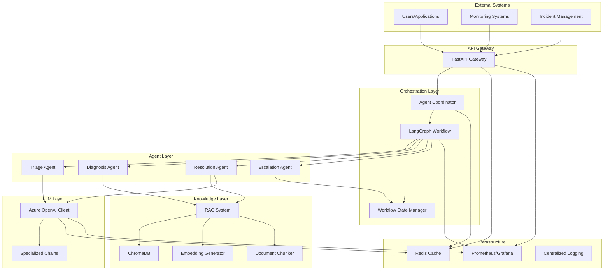
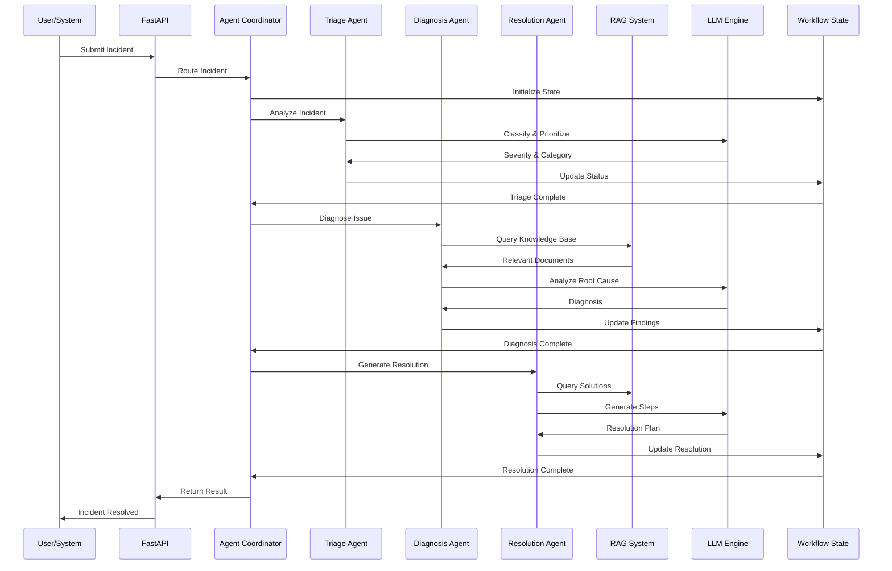

# Architecture

This document provides a comprehensive overview of the Enterprise AI Support Agent architecture, including system design, component interactions, and technology choices.

## 📋 Table of Contents

- [System Overview](#system-overview)
- [Architecture Diagrams](#architecture-diagrams)
- [Component Details](#component-details)
- [Data Flow](#data-flow)
- [Technology Stack](#technology-stack)
- [Design Patterns](#design-patterns)
- [Scalability Considerations](#scalability-considerations)
- [Security Architecture](#security-architecture)

## 🌐 System Overview

The Enterprise AI Support Agent is a distributed, multi-agent system designed to automate incident response through intelligent analysis and resolution. The system uses a microservices-like architecture with clear separation of concerns:

- **API Layer**: RESTful endpoints for external integrations
- **Orchestration Layer**: Multi-agent workflow coordination
- **Knowledge Layer**: Vector-based semantic search
- **LLM Layer**: Language model integration for reasoning
- **Infrastructure Layer**: Docker containerization and CI/CD

## 🏗️ Architecture Diagrams

### High-Level Architecture



### Agent Orchestration Flow



## 🔧 Component Details

### API Layer

**FastAPI Application** (`src/api/main.py`)

- **Purpose**: Provides RESTful API endpoints
- **Key Features**:
  - OpenAPI/Swagger documentation
  - Request/response validation with Pydantic
  - CORS support
  - Health checks
  - Error handling

**Endpoints**:
- `GET /` - Root endpoint
- `GET /health` - Health check
- `POST /incident` - Submit incident
- `POST /rag/query` - Query knowledge base
- `POST /llm/chat` - Direct LLM interaction
- `GET /components` - Component status

### Orchestration Layer

**Agent Coordinator** (`src/orchestration/agent_coordinator.py`)

- **Purpose**: Routes incidents to appropriate agents
- **Key Features**:
  - Agent registry management
  - Conditional routing logic
  - Agent lifecycle management
  - Error recovery

**LangGraph Workflow** (`src/orchestration/workflow.py`)

- **Purpose**: Manages stateful multi-agent workflows
- **Key Features**:
  - State management
  - Conditional transitions
  - Human-in-the-loop support
  - Error recovery

**Workflow State** (`src/orchestration/state.py`)

- **Purpose**: Tracks workflow execution state
- **Key Features**:
  - Pydantic-based validation
  - Incident metadata
  - Agent outputs
  - Error tracking

### Agent Layer

**Triage Agent** (`src/agents/triage.py`)

- **Purpose**: Categorizes and prioritizes incidents
- **Capabilities**:
  - Severity classification (Low/Medium/High/Critical)
  - Category assignment
  - Priority determination

**Diagnosis Agent** (`src/agents/diagnosis.py`)

- **Purpose**: Analyzes root causes
- **Capabilities**:
  - RAG-powered information retrieval
  - Pattern recognition
  - Root cause analysis

**Resolution Agent** (`src/agents/resolution.py`)

- **Purpose**: Generates resolution procedures
- **Capabilities**:
  - Step-by-step instructions
  - Code snippets and commands
  - Verification steps

**Escalation Agent** (`src/agents/escalation.py`)

- **Purpose**: Routes to human operators
- **Capabilities**:
  - Escalation criteria evaluation
  - Human notification
  - Workflow pausing

### Knowledge Layer

**RAG System** (`src/rag/retriever.py`)

- **Purpose**: Retrieves relevant knowledge
- **Key Features**:
  - Vector-based semantic search
  - Metadata filtering
  - Relevance scoring

**ChromaDB Store** (`src/rag/chromadb_store.py`)

- **Purpose**: Vector database for document storage
- **Key Features**:
  - Persistent storage
  - Collection management
  - Query optimization

**Document Chunker** (`src/rag/chunker.py`)

- **Purpose**: Splits documents into chunks
- **Key Features**:
  - Token-based chunking
  - Overlap for context preservation
  - Metadata preservation

**Embedding Generator** (`src/rag/embeddings.py`)

- **Purpose**: Generates text embeddings
- **Key Features**:
  - Azure OpenAI embeddings
  - Batch processing
  - Caching

### LLM Layer

**Azure OpenAI Client** (`src/llm/azure_openai_client.py`)

- **Purpose**: Interface to Azure OpenAI API
- **Key Features**:
  - GPT-4 integration
  - Streaming support
  - Token counting
  - Error handling

**Chain Builder** (`src/llm/chain_builder.py`)

- **Purpose**: Builds specialized LangChain chains
- **Key Features**:
  - Triage chain
  - Diagnosis chain
  - Resolution chain
  - Escalation chain

## 📊 Data Flow

### Incident Processing Flow

1. **Submission**: User submits incident via API
2. **Validation**: API validates request with Pydantic schemas
3. **Routing**: Agent coordinator routes to triage agent
4. **Triage**: Triage agent classifies and prioritizes
5. **Diagnosis**: Diagnosis agent analyzes with RAG
6. **Resolution**: Resolution agent generates solution
7. **Response**: API returns results to user

### Knowledge Retrieval Flow

1. **Query**: RAG system receives query
2. **Embedding**: Query converted to embedding vector
3. **Search**: ChromaDB performs vector similarity search
4. **Rank**: Results ranked by relevance
5. **Return**: Top documents returned to caller

### LLM Generation Flow

1. **Request**: Chain receives generation request
2. **Context**: RAG provides relevant context
3. **Prompt**: System prompt + context + user query
4. **Generation**: LLM generates response
5. **Validation**: Response validated and returned

## 🛠 Technology Stack

### Core Technologies

| Layer | Technology | Version | Purpose |
|-------|-----------|---------|---------|
| **API** | FastAPI | 0.109+ | RESTful API framework |
| **AI** | LangChain | 0.1+ | LLM orchestration |
| **Orchestration** | LangGraph | 0.0+ | Workflow engine |
| **Vector DB** | ChromaDB | 0.4+ | Vector storage |
| **LLM** | Azure OpenAI | 2024-02-15 | GPT-4 |
| **Testing** | Pytest | 7.0+ | Testing framework |
| **Container** | Docker | 24.0+ | Containerization |
| **CI/CD** | GitHub Actions | - | Pipeline automation |

### Development Tools

| Tool | Purpose |
|------|---------|
| **Black** | Code formatting |
| **isort** | Import sorting |
| **flake8** | Linting |
| **mypy** | Type checking |
| **bandit** | Security scanning |
| **trivy** | Vulnerability scanning |
| **pre-commit** | Git hooks |

## 🎨 Design Patterns

### Repository Pattern

Used for data access abstraction:

```python
class ChromaDBStore:
    """Repository for vector operations."""
    
    def add_documents(self, texts, metadatas, ids):
        """Add documents to repository."""
        pass
    
    def query(self, query_text, n_results):
        """Query repository."""
        pass
```

### Strategy Pattern

Used for agent selection:

```python
class AgentCoordinator:
    """Coordinates agent selection."""
    
    def route_to_agent(self, state: WorkflowState) -> str:
        """Route to appropriate agent based on state."""
        if state.current_agent == "triage":
            return "diagnosis"
        elif state.needs_escalation:
            return "escalation"
        return "resolution"
```

### Factory Pattern

Used for chain creation:

```python
class ChainBuilder:
    """Factory for creating LangChain chains."""
    
    def create_triage_chain(self) -> LLMChain:
        """Create triage chain."""
        pass
    
    def create_diagnosis_chain(self) -> ConversationalRetrievalChain:
        """Create diagnosis chain."""
        pass
```

### Observer Pattern

Used for workflow state changes:

```python
class WorkflowState(BaseModel):
    """Observable workflow state."""
    
    _observers: List[Callable] = []
    
    def update_state(self, key: str, value: Any):
        """Update state and notify observers."""
        setattr(self, key, value)
        for observer in self._observers:
            observer(self)
```

## 📈 Scalability Considerations

### Horizontal Scaling

- **API Layer**: Deploy multiple API instances behind load balancer
- **Agent Layer**: Stateless agents can be scaled independently
- **Knowledge Layer**: ChromaDB cluster for distributed vector search

### Vertical Scaling

- **Memory**: Increase memory for larger document collections
- **CPU**: More CPU cores for faster LLM inference
- **GPU**: GPU acceleration for embedding generation

### Performance Optimization

- **Caching**: Redis cache for frequent queries
- **Batching**: Batch embedding generation
- **Async**: Async operations for I/O-bound tasks
- **Connection Pooling**: Database connection pooling

## 🔒 Security Architecture

### Authentication

- API key authentication for external integrations
- OAuth 2.0 support for user authentication
- JWT tokens for session management

### Authorization

- Role-based access control (RBAC)
- Agent-level permissions
- Resource-based access control

### Data Protection

- Encryption at rest (database)
- Encryption in transit (TLS)
- Sensitive data masking
- Audit logging

### Security Scanning

- **Static Analysis**: Bandit for Python security
- **Dependency Scanning**: Trivy for vulnerabilities
- **Secret Detection**: Pre-commit hooks for secrets
- **Runtime Security**: Container scanning

## 🚀 Deployment Architecture

### Development Environment

```
┌─────────────────┐
│  Docker Compose │
├─────────────────┤
│   API Server    │
│   ChromaDB      │
│   Redis         │
│   Nginx (Proxy) │
└─────────────────┘
```

### Production Environment

```
┌─────────────────────────────────────┐
│       Kubernetes Cluster           │
├─────────────────────────────────────┤
│  API Pods (3 replicas)              │
│  ChromaDB StatefulSet               │
│  Redis Cluster (3 nodes)            │
│  Prometheus (Monitoring)            │
│  Grafana (Dashboards)               │
└─────────────────────────────────────┘
         ↓
┌─────────────────────────────────────┐
│       Load Balancer (Nginx)         │
└─────────────────────────────────────┘
```

## 📝 Future Enhancements

- **Multi-tenancy**: Support for multiple organizations
- **Event Streaming**: Apache Kafka for event-driven architecture
- **Machine Learning**: Learn from resolved incidents
- **Real-time Chat**: WebSocket support for live collaboration
- **Mobile App**: Mobile application for incident management
- **Webhooks**: Webhook support for external integrations

---

**Document Version**: 1.0.0  
**Last Updated**: July 24, 2026  
**Maintainer**: Abdul Syed