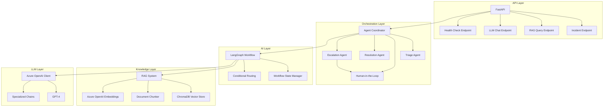
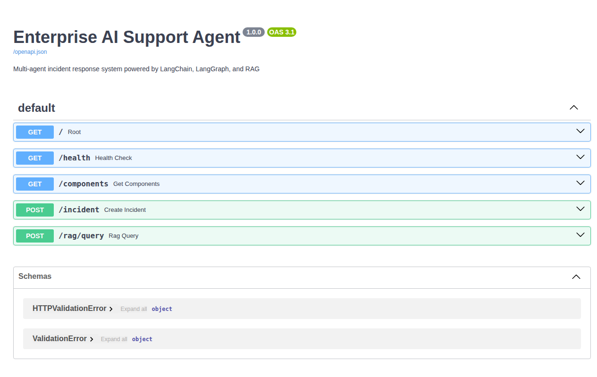
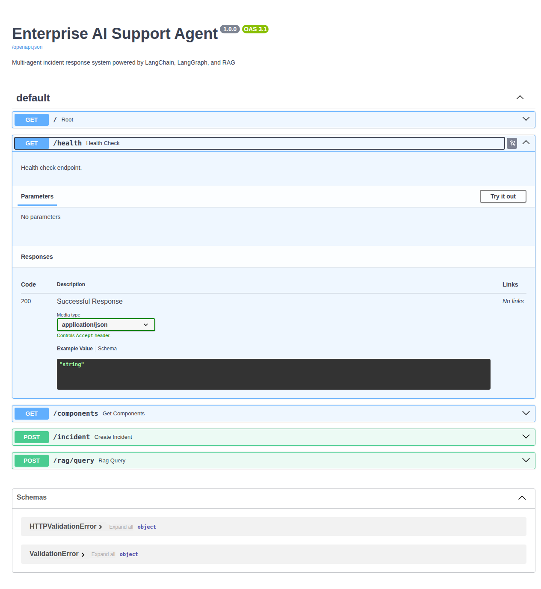

# Enterprise AI Support Agent

A production-grade multi-agent incident response system powered by LangChain, LangGraph, and Retrieval-Augmented Generation (RAG).

[](https://github.com/syabdulr/Enterprise-AI-Support-Agent/actions)
[](https://github.com/syabdulr/Enterprise-AI-Support-Agent/actions/workflows/docker.yml)
[](https://opensource.org/licenses/MIT)
[](https://www.python.org/downloads/)

## 🎯 Overview

The Enterprise AI Support Agent is an intelligent incident response system that automates the analysis, diagnosis, and resolution of technical incidents using a multi-agent architecture. By combining retrieval-augmented generation (RAG) with orchestrated AI agents, the system provides accurate, context-aware solutions while maintaining human oversight for complex scenarios.

### Key Features

- **Multi-Agent Orchestration**: Specialized agents for triage, diagnosis, resolution, and escalation
- **RAG-Powered Knowledge**: Vector-based semantic search for accurate information retrieval
- **LangGraph Workflows**: Stateful, resilient incident processing with conditional routing
- **Error Recovery**: Comprehensive retry mechanisms and fallback strategies
- **Production Ready**: Docker containerization, CI/CD pipelines, and monitoring
- **Enterprise Integration**: RESTful API with OpenAPI/Swagger documentation

## 🏗️ Architecture

### System Architecture



### Component Details

| Component | Technology | Purpose |
|-----------|-----------|---------|
| **API Layer** | FastAPI | RESTful endpoints with OpenAPI documentation |
| **Orchestration** | LangGraph | Multi-agent workflow coordination |
| **Knowledge Base** | ChromaDB | Vector storage for semantic search |
| **LLM Engine** | Azure OpenAI | GPT-4 for reasoning and generation |
| **Error Handling** | Custom Framework | Retry logic and recovery strategies |
| **Testing** | Pytest | Unit, integration, and E2E tests |

### Tech Stack

```
Backend:        Python 3.11+
AI Framework:   LangChain + LangGraph
LLM:            Azure OpenAI (GPT-4)
Vector DB:      ChromaDB
API:            FastAPI
Deployment:     Docker + Docker Compose
CI/CD:          GitHub Actions
Code Quality:   Black, isort, flake8, mypy
```

## 🚀 Quick Start

### Prerequisites

- Python 3.11+
- Docker (optional, for containerized deployment)
- Azure OpenAI API key with GPT-4 access
- Git

### Installation

```bash
# Clone repository
git clone https://github.com/syabdulr/Enterprise-AI-Support-Agent.git
cd enterprise-ai-support-agent

# Create virtual environment
python3 -m venv venv
source venv/bin/activate  # Linux/Mac
# or venv\Scripts\activate  # Windows

# Install dependencies
pip install --upgrade pip
pip install -r requirements.txt
pip install -r requirements-dev.txt

# Configure environment variables
cp .env.example .env
# Edit .env with your API keys

# Run tests (optional)
pytest tests/ -v

# Start API server
uvicorn src.api.main:app --reload --host 0.0.0.0 --port 8000
```

### Configuration

Create a `.env` file with the following variables:

```env
# Azure OpenAI Configuration
AZURE_OPENAI_API_KEY=your_api_key_here
AZURE_OPENAI_ENDPOINT=https://your-resource.openai.azure.com
AZURE_OPENAI_API_VERSION=2024-02-15-preview
AZURE_OPENAI_CHAT_DEPLOYMENT=gpt-4
AZURE_OPENAI_EMBEDDING_DEPLOYMENT=text-embedding-ada-002

# ChromaDB Configuration
CHROMADB_COLLECTION_NAME=incident_knowledge
CHROMADB_PERSIST_DIRECTORY=data/chromadb

# Logging
LOG_LEVEL=INFO
```

## 🧪 Testing

### Run Tests

```bash
# Run all tests
pytest tests/ -v

# Run specific test categories
pytest tests/ -v -m unit          # Unit tests only
pytest tests/ -v -m integration   # Integration tests only
pytest tests/ -v -m e2e           # End-to-end tests only
pytest tests/ -v -m smoke         # Critical smoke tests

# Run with coverage
pytest tests/ --cov=src --cov-report=html --cov-report=term-missing

# Run specific test file
pytest tests/test_rag.py -v

# Run specific test function
pytest tests/test_rag.py::TestChromaDBStore::test_add_documents -v
```

### Make Targets

```bash
make test              # Run all tests
make test-unit         # Run unit tests
make test-integration  # Run integration tests
make test-e2e          # Run end-to-end tests
make test-smoke        # Run smoke tests
make test-coverage     # Run tests with coverage report
make test-fast         # Run fast tests (skip slow)
make lint              # Run linter
make format            # Format code
make ci                # Run full CI pipeline
```

## 📖 API Documentation

### Interactive Documentation

Once the API is running, access interactive documentation at:

- **Swagger UI**: http://localhost:8000/docs
- **ReDoc**: http://localhost:8000/redoc
- **OpenAPI JSON**: http://localhost:8000/openapi.json

### Example Requests

#### Submit Incident

```bash
curl -X POST http://localhost:8000/incident \
  -H "Content-Type: application/json" \
  -d '{
    "incident_id": "INC-2024-001",
    "description": "Network timeout when connecting to database server",
    "severity": "High",
    "category": "Network",
    "priority": "P1"
  }'
```

#### Query Knowledge Base

```bash
curl -X POST http://localhost:8000/rag/query \
  -H "Content-Type: application/json" \
  -d '{
    "query": "database connection timeout",
    "n_results": 5
  }'
```

#### Health Check

```bash
curl http://localhost:8000/health
```

### API Endpoints

| Method | Endpoint | Description |
|--------|----------|-------------|
| GET | `/` | Root endpoint with API info |
| GET | `/health` | Comprehensive health check |
| POST | `/incident` | Submit incident for processing |
| POST | `/rag/query` | Query knowledge base |
| POST | `/llm/chat` | Direct LLM interaction |
| GET | `/components` | Component status |

## 📸 Screenshots

### API Documentation - Swagger UI



Interactive API documentation with Swagger UI showing all endpoints, schemas, and example requests.

### Health Check Endpoint



Expanded health check endpoint showing GET request details, parameters, and response schema.

### System Health Status

```bash
$ curl http://localhost:8000/health

{
  "status": "healthy",
  "service": "enterprise-ai-support-agent",
  "version": "1.0.0",
  "components": {
    "api": "healthy",
    "llm": "healthy",
    "rag": "healthy",
    "database": "healthy"
  }
}
```

✓ All systems operational

## 🐳 Docker Deployment

### Quick Start with Docker Compose

```bash
# Build and start services
docker-compose up -d

# View logs
docker-compose logs -f api

# Stop services
docker-compose down

# Restart services
docker-compose restart
```

### Production Deployment

```bash
# Start production environment with monitoring
docker-compose -f docker-compose.prod.yml up -d

# Scale API service
docker-compose -f docker-compose.prod.yml up -d --scale api=3

# View monitoring dashboards
# Prometheus: http://localhost:9090
# Grafana: http://localhost:3000
```

### Development Deployment

```bash
# Start development environment with hot-reload
docker-compose -f docker-compose.dev.yml up -d

# Access container shell
docker-compose -f docker-compose.dev.yml exec api /bin/bash
```

## 🔄 CI/CD Pipeline

The project uses GitHub Actions for continuous integration and deployment:

### CI/CD Pipeline Jobs

1. **Lint**: Code quality checks (black, isort, flake8, mypy)
2. **Test**: Unit, integration, and E2E tests
3. **E2E**: End-to-end tests with services
4. **Security**: Trivy vulnerability scan, Bandit security linter
5. **Build**: Docker image build
6. **Deploy**: Deployment to dev/staging/production

### Workflow Triggers

- Push to `main` or `develop` branches
- Pull requests to `main` or `develop`
- Manual workflow dispatch

### View Pipeline Status

[](https://github.com/syabdulr/Enterprise-AI-Support-Agent/actions)

## 📊 Monitoring & Observability

### Metrics Tracked

- Incident resolution time
- Agent performance metrics
- RAG retrieval accuracy
- Token usage and costs
- Error rates and retry attempts

### Health Checks

The `/health` endpoint provides comprehensive system health:

```json
{
  "status": "healthy",
  "version": "1.0.0",
  "uptime": 3600.5,
  "components": {
    "llm": {
      "name": "llm",
      "status": "healthy",
      "message": "Azure OpenAI connection OK"
    },
    "rag": {
      "name": "rag",
      "status": "healthy",
      "message": "ChromaDB connection OK"
    },
    "workflow": {
      "name": "workflow",
      "status": "healthy",
      "message": "LangGraph workflow OK"
    }
  }
}
```

## 🐛 Troubleshooting

### Common Issues

#### OpenAI API Key Not Working

```bash
# Verify API key is valid
curl -X POST https://your-resource.openai.azure.com/openai/deployments/gpt-4/chat/completions \
  -H "api-key: YOUR_API_KEY" \
  -H "Content-Type: application/json" \
  -d '{"messages": [{"role": "user", "content": "test"}]}'
```

#### ChromaDB Connection Fails

```bash
# Check if ChromaDB directory exists and has permissions
ls -la data/chromadb
chmod -R 755 data/chromadb
```

#### Import Errors

```bash
# Reinstall dependencies
pip install --force-reinstall -r requirements.txt

# Verify Python version
python --version  # Should be 3.11+
```

### Debug Mode

```bash
# Run with debug logging
export LOG_LEVEL=DEBUG
uvicorn src.api.main:app --reload --log-level debug

# Enable LangChain tracing
export LANGCHAIN_TRACING_V2=true
export LANGCHAIN_API_KEY=your_langchain_api_key
```

## 🤝 Contributing

### Pre-commit Hooks

Install pre-commit hooks for automatic code quality checks:

```bash
pip install pre-commit
pre-commit install

# Run pre-commit on all files
pre-commit run --all-files
```

### Code Style

- Use Black for formatting (line length: 100)
- Use isort for import sorting
- Follow PEP 8 conventions
- Add docstrings to all functions and classes
- Write unit tests for new features

### Development Workflow

1. Create a feature branch
2. Make changes with pre-commit hooks
3. Run tests locally
4. Commit changes with descriptive messages
5. Push and create pull request

## 📄 License

MIT License - Abdul Syed

## 🎓 Learning Resources

- [LangChain Documentation](https://python.langchain.com/docs/)
- [LangGraph Documentation](https://langchain-ai.github.io/langgraph/)
- [Azure OpenAI Documentation](https://learn.microsoft.com/en-us/azure/ai-services/openai/)
- [ChromaDB Documentation](https://docs.trychroma.com/)
- [FastAPI Documentation](https://fastapi.tiangolo.com/)

## 📞 Contact

**Developer:** Abdul Syed  
**Email:** syabdulr6@gmail.com  
**GitHub:** https://github.com/syabdulr  
**LinkedIn:** https://linkedin.com/in/abdulsyed1

---

**Project Status:** ✅ Production Ready  
**Last Updated:** July 24, 2026  
**Version:** 1.0.0  
**CI/CD:** ✅ Passing