# Architecture Diagrams

This document contains detailed architecture diagrams for the Enterprise AI Support Agent system.

## Table of Contents

- [System Architecture](#system-architecture)
- [Component Architecture](#component-architecture)
- [Data Flow Diagrams](#data-flow-diagrams)
- [Deployment Architecture](#deployment-architecture)
- [Sequence Diagrams](#sequence-diagrams)

## System Architecture

### High-Level System View

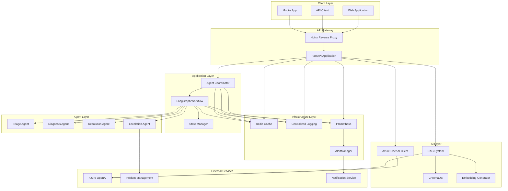

## Component Architecture

### API Layer Components

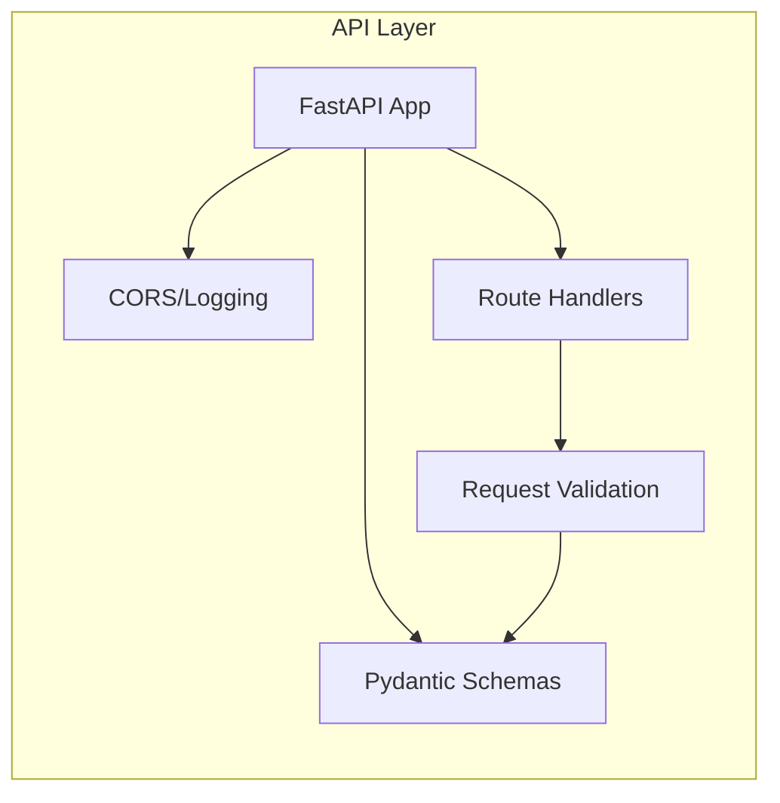

### Orchestration Layer Components

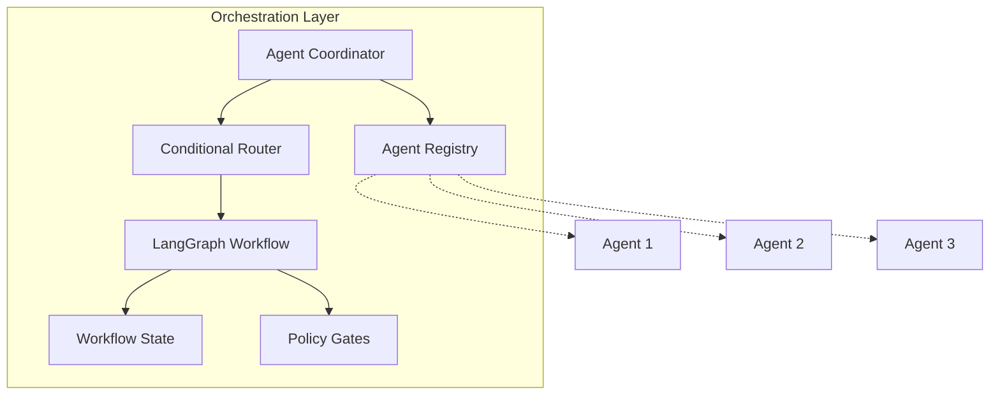

### RAG System Components

```mermaid
graph LR
    subgraph "RAG System"
        RETRIEVER[RAG Retriever]
        LOADER[Document Loader]
        CHUNKER[Text Chunker]
        EMBED[Embedding Generator]
        STORE[ChromaDB Store]
    end
    
    RETRIEVER --> STORE
    RETRIEVER --> EMBED
    STORE <-- CHUNKER
    CHUNKER <-- LOADER
    EMBED --> CHUNKER
```

### LLM Layer Components

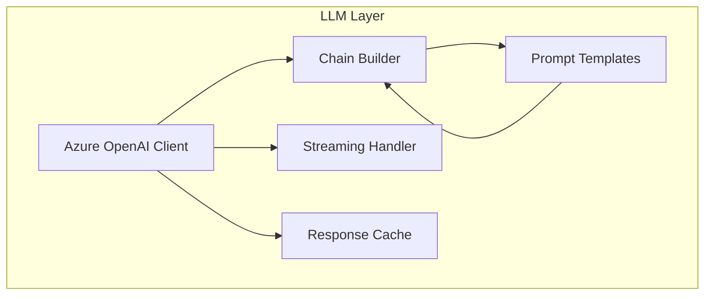

## Data Flow Diagrams

### Incident Processing Flow

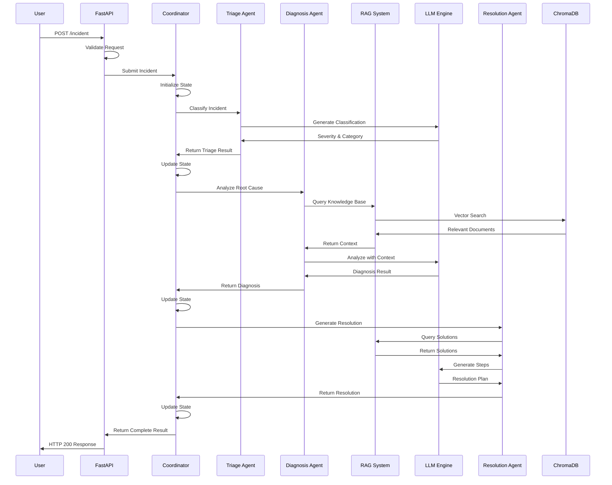

### RAG Query Flow

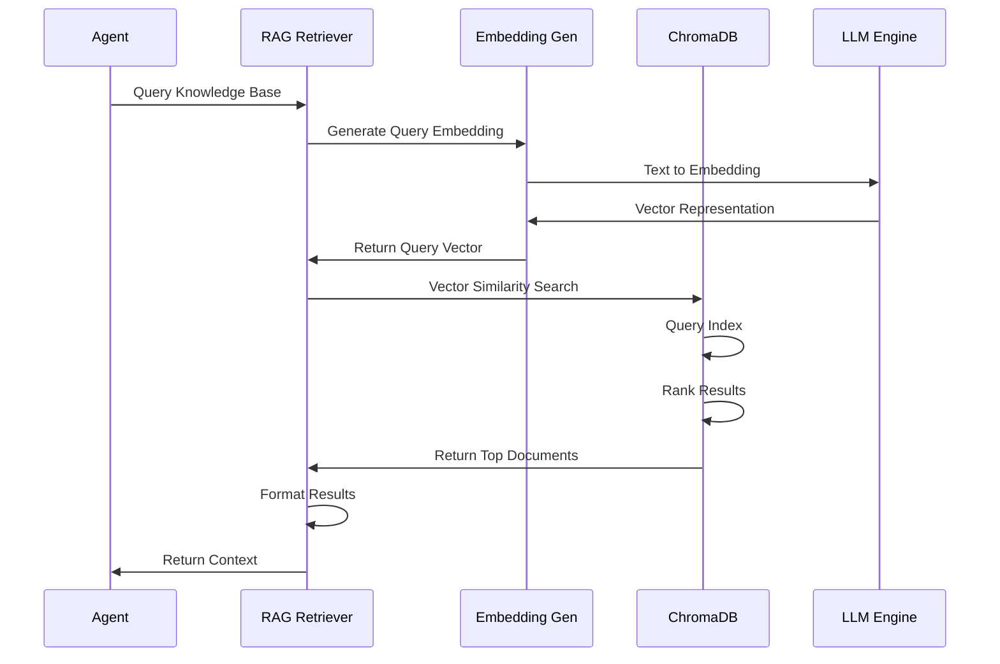

### LLM Generation Flow

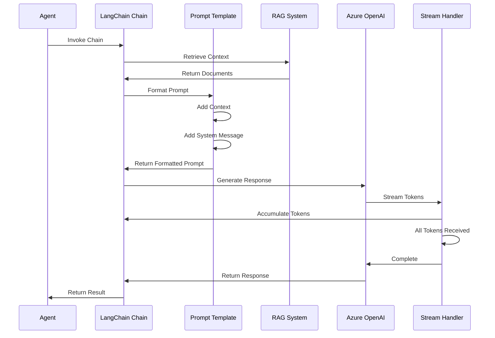

## Deployment Architecture

### Development Environment

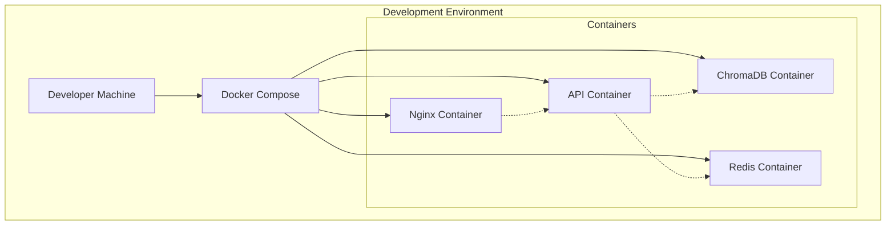

### Production Environment

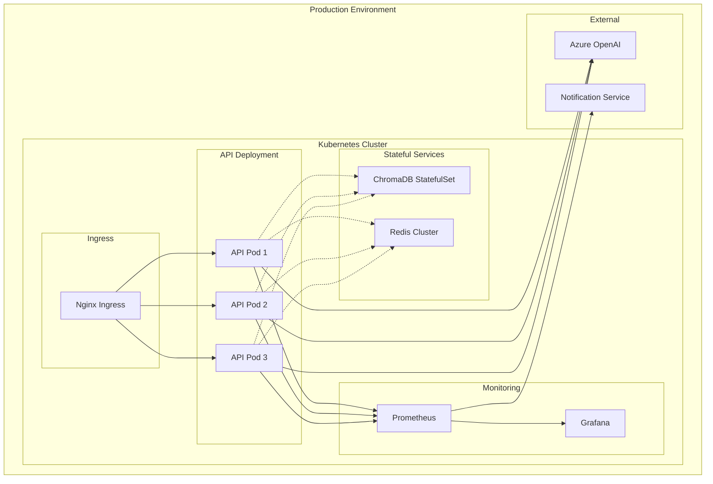

## Sequence Diagrams

### Multi-Agent Workflow

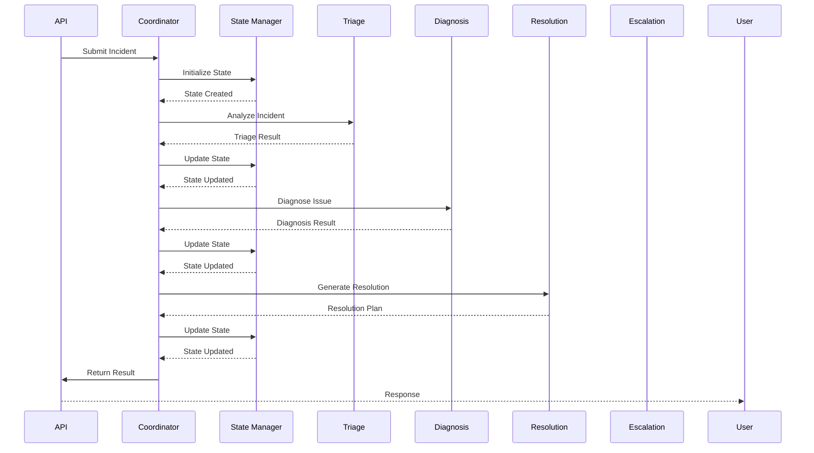

### Error Recovery Flow

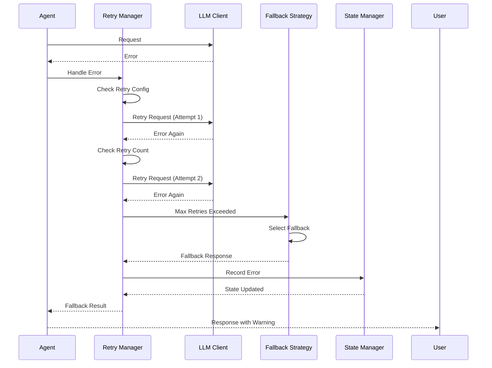

### Human-in-the-Loop Flow

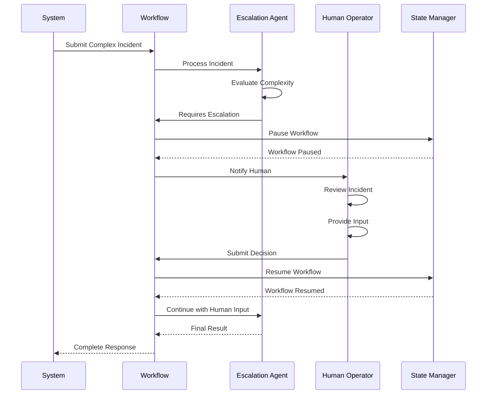

---

**Document Version:** 1.0.0  
**Last Updated:** July 24, 2026  
**Maintainer:** Abdul Syed