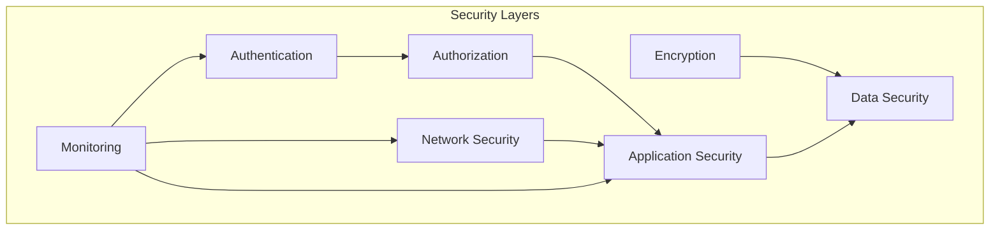

# Security Guide

This document provides comprehensive security guidelines and best practices for the Enterprise AI Support Agent.

## Table of Contents

- [Security Overview](#security-overview)
- [Authentication & Authorization](#authentication--authorization)
- [Data Protection](#data-protection)
- [API Security](#api-security)
- [Infrastructure Security](#infrastructure-security)
- [Secrets Management](#secrets-management)
- [Security Scanning](#security-scanning)
- [Incident Response](#incident-response)
- [Compliance](#compliance)

## Security Overview

### Security Principles

1. **Defense in Depth**: Multiple layers of security controls
2. **Least Privilege**: Minimal access required for functionality
3. **Secure by Default**: Security-first approach to development
4. **Continuous Monitoring**: Ongoing security monitoring and alerts
5. **Rapid Response**: Quick incident response and remediation

### Security Model



## Authentication & Authorization

### Authentication Methods

#### API Key Authentication

```python
# Add API key authentication
from fastapi import Security, HTTPException, status
from fastapi.security import APIKeyHeader

API_KEY_NAME = "X-API-Key"
api_key_header = APIKeyHeader(name=API_KEY_NAME, auto_error=False)

async def get_api_key(api_key_header: str = Security(api_key_header)):
    if api_key_header != os.getenv("API_KEY"):
        raise HTTPException(
            status_code=status.HTTP_403_FORBIDDEN,
            detail="Invalid or missing API Key"
        )
    return api_key_header

@app.post("/incident", dependencies=[Depends(get_api_key)])
async def handle_incident(incident: Incident):
    pass
```

#### OAuth 2.0 / JWT

```python
from fastapi.security import OAuth2PasswordBearer
from jose import jwt

oauth2_scheme = OAuth2PasswordBearer(tokenUrl="token")

async def get_current_user(token: str = Depends(oauth2_scheme)):
    credentials_exception = HTTPException(
        status_code=status.HTTP_401_UNAUTHORIZED,
        detail="Could not validate credentials",
        headers={"WWW-Authenticate": "Bearer"},
    )
    try:
        payload = jwt.decode(token, SECRET_KEY, algorithms=[ALGORITHM])
        username: str = payload.get("sub")
        if username is None:
            raise credentials_exception
    except JWTError:
        raise credentials_exception
    return username
```

### Authorization

#### Role-Based Access Control (RBAC)

```python
from enum import Enum

class Role(str, Enum):
    ADMIN = "admin"
    OPERATOR = "operator"
    VIEWER = "viewer"

def require_role(required_role: Role):
    def role_checker(current_user: User = Depends(get_current_user)):
        if current_user.role != required_role and current_user.role != Role.ADMIN:
            raise HTTPException(
                status_code=status.HTTP_403_FORBIDDEN,
                detail="Insufficient permissions"
            )
        return current_user
    return role_checker

@app.post("/incident", dependencies=[Depends(require_role(Role.OPERATOR))])
async def handle_incident(incident: Incident):
    pass
```

## Data Protection

### Encryption at Rest

#### Database Encryption

```yaml
# docker-compose.yml
services:
  chromadb:
    environment:
      - CHROMADB_SERVER_AUTH_CREDENTIALS_FILE=/secrets/db_credentials
      - CHROMADB_ENCRYPTION_KEY=${ENCRYPTION_KEY}
    volumes:
      - ./secrets:/secrets
```

#### File Encryption

```python
from cryptography.fernet import Fernet

def encrypt_file(file_path: str, key: str):
    fernet = Fernet(key)
    with open(file_path, 'rb') as f:
        data = f.read()
    encrypted = fernet.encrypt(data)
    with open(f"{file_path}.enc", 'wb') as f:
        f.write(encrypted)
```

### Encryption in Transit

#### TLS/SSL Configuration

```python
# uvicorn with SSL
uvicorn src.api.main:app \
  --host 0.0.0.0 \
  --port 8000 \
  --ssl-keyfile /secrets/key.pem \
  --ssl-certfile /secrets/cert.pem \
  --ssl-version 3
```

#### Force HTTPS

```python
from starlette.middleware.httpsredirect import HTTPSRedirectMiddleware

app.add_middleware(HTTPSRedirectMiddleware)
```

## API Security

### Rate Limiting

```python
from slowapi import Limiter
from slowapi.util import get_remote_address

limiter = Limiter(key_func=get_remote_address)
app.state.limiter = limiter

@app.post("/incident")
@limiter.limit("10/minute")
async def handle_incident(incident: Incident):
    pass
```

### Input Validation

```python
from pydantic import validator, constr

class IncidentRequest(BaseModel):
    incident_id: constr(min_length=1, max_length=50)
    description: constr(min_length=10, max_length=1000)
    
    @validator('incident_id')
    def validate_incident_id(cls, v):
        if not v.isalnum():
            raise ValueError('Incident ID must be alphanumeric')
        return v
```

### SQL Injection Prevention

```python
# Use parameterized queries
def get_incident(incident_id: str):
    query = "SELECT * FROM incidents WHERE id = ?"
    cursor.execute(query, (incident_id,))
```

### XSS Prevention

```python
from fastapi.responses import JSONResponse

@app.get("/incident/{incident_id}")
async def get_incident(incident_id: str):
    incident = get_incident_from_db(incident_id)
    # JSONResponse automatically escapes HTML
    return JSONResponse(content=incident.dict())
```

## Infrastructure Security

### Docker Security

#### Run as Non-Root User

```dockerfile
# Dockerfile
RUN useradd -m appuser
USER appuser
```

#### Read-Only Filesystem

```yaml
# docker-compose.yml
services:
  api:
    read_only: true
    tmpfs:
      - /tmp
```

#### Resource Limits

```yaml
# docker-compose.yml
services:
  api:
    deploy:
      resources:
        limits:
          cpus: '1.0'
          memory: 512M
        reservations:
          cpus: '0.5'
          memory: 256M
```

### Network Security

#### Firewall Configuration

```bash
# UFW configuration
ufw default deny incoming
ufw default allow outgoing
ufw allow 22/tcp    # SSH
ufw allow 443/tcp   # HTTPS
ufw allow 8000/tcp  # API
ufw enable
```

#### Network Segmentation

```yaml
# docker-compose.yml
services:
  api:
    networks:
      - frontend
      - backend
  
  chromadb:
    networks:
      - backend
  
  redis:
    networks:
      - backend

networks:
  frontend:
  backend:
    internal: true
```

## Secrets Management

### Environment Variables

```bash
# .env (never commit this file)
AZURE_OPENAI_API_KEY=your_api_key_here
API_KEY=your_api_key_here
ENCRYPTION_KEY=your_encryption_key_here
```

### Docker Secrets

```yaml
# docker-compose.yml
services:
  api:
    secrets:
      - azure_openai_key
      - api_key

secrets:
  azure_openai_key:
    file: ./secrets/azure_openai_key.txt
  api_key:
    file: ./secrets/api_key.txt
```

### AWS Secrets Manager

```python
import boto3

def get_secret(secret_name: str):
    client = boto3.client('secretsmanager')
    response = client.get_secret_value(SecretId=secret_name)
    return response['SecretString']
```

### Azure Key Vault

```python
from azure.keyvault.secrets import SecretClient
from azure.identity import DefaultAzureCredential

def get_secret(vault_url: str, secret_name: str):
    credential = DefaultAzureCredential()
    client = SecretClient(vault_url=vault_url, credential=credential)
    return client.get_secret(secret_name).value
```

## Security Scanning

### Static Application Security Testing (SAST)

#### Bandit

```bash
# Run Bandit security scanner
bandit -r src/ -f json -o bandit-report.json
```

#### Pre-commit Hook

```yaml
# .pre-commit-config.yaml
repos:
  - repo: https://github.com/PyCQA/bandit
    rev: 1.7.6
    hooks:
      - id: bandit
        args: ['-r', 'src/', '-ll', '-ii']
```

### Dependency Scanning

#### Trivy

```bash
# Scan for vulnerabilities
trivy fs . --security-checks vuln,config
```

#### GitHub Actions

```yaml
# .github/workflows/security.yml
- name: Run Trivy vulnerability scanner
  uses: aquasecurity/trivy-action@master
  with:
    scan-type: 'fs'
    scan-ref: '.'
    format: 'sarif'
    output: 'trivy-results.sarif'
```

### Container Scanning

```yaml
# .github/workflows/docker.yml
- name: Build and scan Docker image
  uses: docker/build-push-action@v5
  with:
    context: .
    push: true
    tags: ${{ steps.meta.outputs.tags }}
    cache-from: type=gha

- name: Run Trivy on Docker image
  uses: aquasecurity/trivy-action@master
  with:
    image-ref: ${{ steps.meta.outputs.tags }}
    format: 'sarif'
    output: 'trivy-results.sarif'
```

## Incident Response

### Incident Response Plan

1. **Detection**
   - Monitor security alerts
   - Review logs for anomalies
   - Scan for vulnerabilities

2. **Containment**
   - Isolate affected systems
   - Block malicious IPs
   - Disable compromised accounts

3. **Eradication**
   - Remove malware
   - Patch vulnerabilities
   - Update signatures

4. **Recovery**
   - Restore from backups
   - Verify system integrity
   - Monitor for recurrence

5. **Lessons Learned**
   - Document incident
   - Update procedures
   - Train staff

### Security Metrics

- Mean Time to Detect (MTTD)
- Mean Time to Respond (MTTR)
- Number of security incidents
- Vulnerability scan results
- Compliance status

## Compliance

### GDPR Compliance

- Data minimization
- Right to erasure
- Data portability
- Consent management
- Breach notification

### SOC 2 Compliance

- Access controls
- Change management
- Incident response
- Monitoring and logging
- Risk assessment

### ISO 27001

- Information security policy
- Asset management
- Access control
- Cryptography
- Physical security

## Security Checklist

### Development

- [ ] Code reviewed for security issues
- [ ] Dependencies scanned for vulnerabilities
- [ ] Secrets not committed to version control
- [ ] Environment variables used for configuration
- [ ] Input validation implemented
- [ ] Output encoding for XSS prevention
- [ ] SQL injection prevented
- [ ] Authentication implemented
- [ ] Authorization checks in place

### Deployment

- [ ] TLS/SSL configured
- [ ] Firewall rules configured
- [ ] Secrets managed securely
- [ ] Container images scanned
- [ ] Network segmentation implemented
- [ ] Resource limits configured
- [ ] Logging enabled
- [ ] Monitoring configured
- [ ] Backup strategy in place
- [ ] Disaster recovery plan tested

### Operations

- [ ] Security monitoring enabled
- [ ] Alerts configured
- [ ] Incident response plan documented
- [ ] Regular security audits scheduled
- [ ] Penetration testing performed
- [ ] Security training completed
- [ ] Compliance requirements met
- [ ] Data retention policy enforced

---

**Document Version:** 1.0.0  
**Last Updated:** July 24, 2026  
**Maintainer:** Abdul Syed